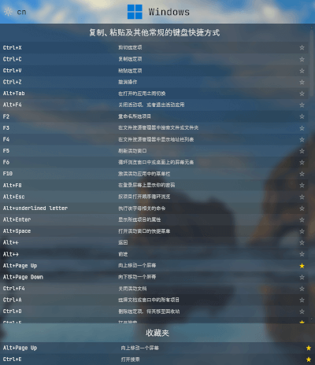

# Little Tips

显示活动窗口的快捷键列表。

- 轻量安装文件
- 干净简洁的用户界面
- 最小资源使用
- 浅色/深色主题
- 亚克力效果
- 中文/英文切换
- 收藏常用快捷键
- 丰富的软件支持列表

## [下载](https://github.com/chenjing1294/Little-Tips/releases)

感谢您的捐助，将有助于“小技巧”的后续开发，善款将用于硬件、软件、服务器托管等费用。

再次感谢您的支持！

## 捐助

---

Displays a list of shortcut keys for the active window. 

## [Download](https://github.com/chenjing1294/Little-Tips/releases)

- Lightweight installation files
- Clean and simple user interface
- Minimal resource usage
- Light/Dark themes
- Acrylic effect
- Chinese/English switch
- Favorite frequently used shortcut keys
- Extensive software support list

## Donate

Thank you for your donation, it will help the subsequent development of "Little Tips", donations will be used for hardware, software, server hosting and other expenses.

Thanks again for your support!

[PayPal](https://paypal.me/chenjing9412)
